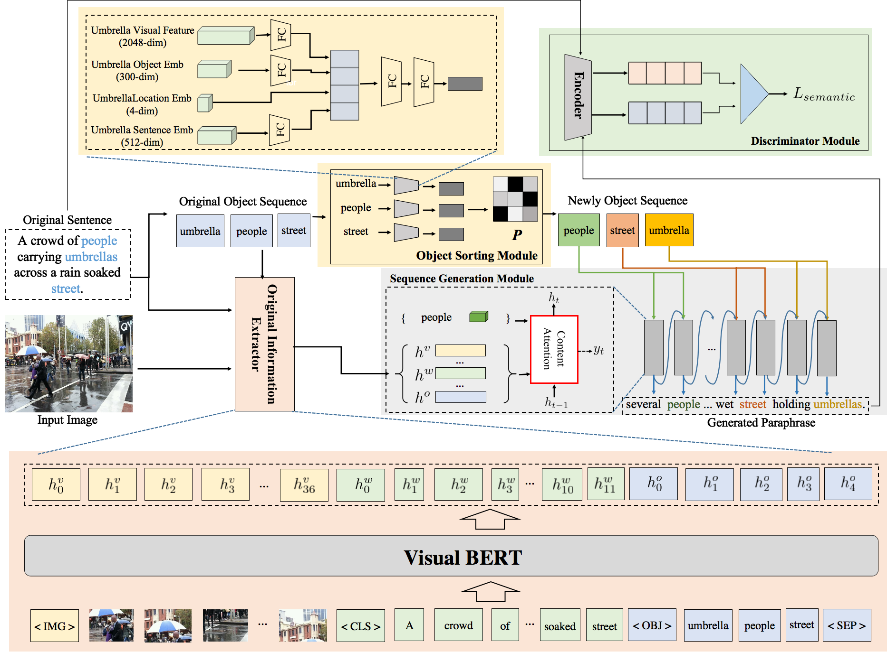

# Ob-VPG: Object-level Visual Paraphrase Generation

> Official code for [Visual Paraphrase Generation with Key Information Retained]()



## Requirements and Setup

1. Install Anaconda or Miniconda distribution based on Python3+ from their [downloads' site](https://conda.io/docs/user-guide/install/download.html).
2. Install python package the code needs.

## Dataset & Pretrain VisualBERT model

All the training, validation and test data in the `data_sentences` folder.

* All this data is preprocessed from the MSCOCO caption dataset.
* More details about preprocessing, you can see in [repository](https://github.com/Gary-code/PQG)

You can download visualBERT model from [link](https://huggingface.co/uclanlp/visualbert-vqa-coco-pre)

## Training & Evaluation

```python
python train.py
```